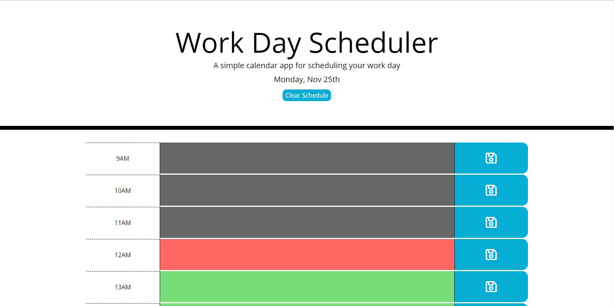

# day-planner
Assignment 5 for University of Toronto coding bootcamp.
Live Demo: https://andydurette.github.io/day-planner/

This assignment focused on creating a local storage area that stores tiem events for the day using jQuery and using moment.js to check weather the time for those events has past or not.

I handled this by creating an event object for each of the times throughout the day to call data to or save data from.

